# 02 — Arquitetura do Sistema

> *"Dois binários. Um Codebook. Zero dependências externas."*

---

## Visão Geral da Arquitetura

O CROM opera como um sistema de **compilação/decompilação** simétrico, composto por três componentes fundamentais:

```
┌─────────────────────────────────────────────────────────────────────┐
│                        CROM RUNTIME                                 │
│                                                                     │
│  ┌──────────────┐    ┌────────────────┐    ┌──────────────────┐    │
│  │  crompressor-pack   │    │   Codebook     │    │   crompressor-unpack    │    │
│  │ (Compilador) │◄──▶│  Universal     │◄──▶│ (Decompilador)   │    │
│  └──────┬───────┘    │  (.cromdb)     │    └──────┬───────────┘    │
│         │            │   50GB+        │           │                 │
│         │            └────────────────┘           │                 │
│         ▼                                         ▼                 │
│  ┌──────────────┐                         ┌──────────────────┐     │
│  │ Arquivo .crom│ ─────────────────────▶  │ Arquivo Original │     │
│  │ (Compacto)   │     Transferência       │  (Restaurado)    │     │
│  └──────────────┘                         └──────────────────┘     │
└─────────────────────────────────────────────────────────────────────┘
```

---

## Pipeline do `crompressor-pack` (Compilador)

O compilador transforma arquivos originais em arquivos `.crom` — estruturas compactas de referências.

### Etapa 1: Ingestão e Chunking

```
Arquivo Original (N bytes)
        │
        ▼
┌───────────────────────────────────┐
│        CHUNKING ENGINE            │
│                                   │
│  Estratégia Adaptativa:           │
│  ├─ Tamanho fixo (64-512 bytes)   │
│  ├─ Content-Defined (Rabin)       │
│  └─ Tipo-específico (PNG, PDF)    │
│                                   │
│  Output: []Chunk{data, offset,    │
│          size, hash}              │
└───────────────────────────────────┘
        │
        ▼
   [C₁, C₂, C₃, ..., Cₙ]  (Array de Chunks)
```

O chunking é **adaptativo**: arquivos binários usam blocos fixos, enquanto documentos estruturados usam Content-Defined Chunking (CDC) baseado em fingerprints de Rabin para encontrar fronteiras naturais.

### Etapa 2: Busca no Espaço Latente (HNSW)

```
Para cada Chunk Cᵢ:
        │
        ▼
┌───────────────────────────────────────┐
│         HNSW SEARCH ENGINE            │
│                                       │
│  Input:  Hash/Embedding do Chunk Cᵢ   │
│  Index:  Codebook (50GB, mmap'd)      │
│  Método: Busca de Vizinhos Próximos   │
│                                       │
│  Output: {                            │
│    codebook_id: uint64,               │
│    similarity:  float32,              │
│    pattern:     []byte                │
│  }                                    │
└───────────────────────────────────────┘
```

A busca utiliza **HNSW (Hierarchical Navigable Small World)**, um algoritmo de busca aproximada de vizinhos mais próximos que opera em tempo O(log n) — permitindo buscar em bilhões de padrões em milissegundos.

### Etapa 3: Cálculo do Delta (Resíduo Lossless)

```
┌──────────────────────────────────────┐
│         DELTA ENGINE                 │
│                                      │
│  Chunk Original:    [0xFA, 0x3C, ...]│
│  Padrão Codebook:   [0xFA, 0x3D, ...]│
│                     ────────────────  │
│  Delta (XOR):       [0x00, 0x01, ...]│
│                                      │
│  Compressão do Delta: zstd(delta)    │
│  (Maioria será 0x00 → comprime bem)  │
└──────────────────────────────────────┘
```

O Delta é o **XOR** entre o chunk original e o padrão encontrado no Codebook. Como o padrão tende a ser muito similar, o Delta conterá longas sequências de zeros, que comprimem extraordinariamente bem com algoritmos tradicionais.

### Etapa 4: Serialização do Arquivo `.crom`

```
┌─────────────────────────────────────────────┐
│           FORMATO .crom                      │
│                                              │
│  Header:                                     │
│  ├─ Magic Number:    "CROM" (4 bytes)        │
│  ├─ Versão:          uint16                  │
│  ├─ Codebook Hash:   SHA-256 (32 bytes)      │
│  ├─ Original Hash:   SHA-256 (32 bytes)      │
│  ├─ Original Size:   uint64                  │
│  ├─ Chunk Count:     uint32                  │
│  └─ Chunk Strategy:  uint8                   │
│                                              │
│  Chunk Table:                                │
│  ├─ [0] { codebook_id, delta_offset,         │
│  │        delta_size, original_size }        │
│  ├─ [1] { ... }                              │
│  └─ [N] { ... }                              │
│                                              │
│  Delta Pool:                                 │
│  ├─ zstd_compressed(deltas[0..N])            │
│  └─ (Bloco único para compressão contígua)   │
│                                              │
│  Footer:                                     │
│  └─ CRC32 do arquivo .crom                   │
└─────────────────────────────────────────────┘
```

---

## Pipeline do `crompressor-unpack` (Decompilador)

O decompilador é **mais simples e mais rápido** que o compilador, pois não precisa fazer buscas — apenas lookups diretos.

```
┌───────────────────────────────────────────────────┐
│                  crompressor-unpack                       │
│                                                    │
│  1. Ler Header do .crom                            │
│     └─ Validar Magic Number e versão               │
│     └─ Verificar hash do Codebook (segurança)      │
│                                                    │
│  2. Mapear Codebook via mmap                       │
│     └─ OS carrega páginas sob demanda              │
│                                                    │
│  3. Para cada entrada na Chunk Table:              │
│     ├─ Lookup direto: codebook[id] → pattern       │
│     ├─ Descomprimir delta do Delta Pool            │
│     ├─ XOR(pattern, delta) → chunk_original        │
│     └─ Escrever chunk no arquivo de saída          │
│                                                    │
│  4. Validar SHA-256 do arquivo reconstruído        │
│     └─ Se ≠ original hash → ERRO (falha de integ.)│
│                                                    │
│  Complexidade: O(n) onde n = número de chunks      │
│  Sem busca. Sem heurísticas. Pura reconstrução.    │
└───────────────────────────────────────────────────┘
```

### Assimetria Proposital

| Operação | Complexidade | Tempo Estimado (1GB) |
|---|---|---|
| **crompressor-pack** (Compilação) | O(n × log M) | ~30-120 segundos |
| **crompressor-unpack** (Decompilação) | O(n) | ~2-5 segundos |

Onde:
- `n` = número de chunks no arquivo
- `M` = número de entradas no Codebook

A compilação é **deliberadamente mais lenta** (pois envolve busca HNSW), enquanto a decompilação é **quase instantânea** (apenas lookups diretos + XOR).

---

## Diagrama de Componentes Go

```
cmd/
├── crompressor-pack/           # CLI do Compilador
│   └── main.go
├── crompressor-unpack/         # CLI do Decompilador
│   └── main.go
└── crompressor-verify/         # CLI de Verificação
    └── main.go

internal/
├── chunker/             # Engine de Chunking adaptativo
│   ├── fixed.go         # Chunking de tamanho fixo
│   ├── rabin.go         # Content-Defined Chunking
│   └── chunker.go       # Interface e seletor
├── codebook/            # Acesso ao Codebook
│   ├── mmap.go          # Memory mapping do .cromdb
│   ├── lookup.go        # Lookup direto por ID
│   └── search.go        # Busca HNSW
├── delta/               # Engine de Delta/Resíduo
│   ├── xor.go           # Cálculo XOR
│   └── compress.go      # Compressão do delta (zstd)
├── format/              # Formato do arquivo .crom
│   ├── header.go
│   ├── chunktable.go
│   └── writer.go
└── verify/              # Validação de integridade
    └── sha256.go
```

---

## Fluxo de Dados Completo

```mermaid
graph LR
    A[Arquivo Original] --> B[Chunking Engine]
    B --> C{Para cada Chunk}
    C --> D[HNSW Search no Codebook]
    D --> E[Match: Codebook ID + Pattern]
    E --> F[XOR: Chunk - Pattern = Delta]
    F --> G[Zstd: Comprimir Delta]
    G --> H[Serializar .crom]
    
    H --> I[Transferência/Armazenamento]
    
    I --> J[Ler .crom Header]
    J --> K{Para cada Chunk ID}
    K --> L[Lookup Direto no Codebook]
    L --> M[Descomprimir Delta]
    M --> N[XOR: Pattern + Delta = Chunk Original]
    N --> O[Escrever no Disco]
    O --> P[Validar SHA-256]
    
    style D fill:#f9a825
    style L fill:#66bb6a
```



---

> **Próximo:** [03 - Estrutura do Dicionário](03-ESTRUTURA_DO_DICIONARIO.md) — Detalhes internos do Codebook Universal.
