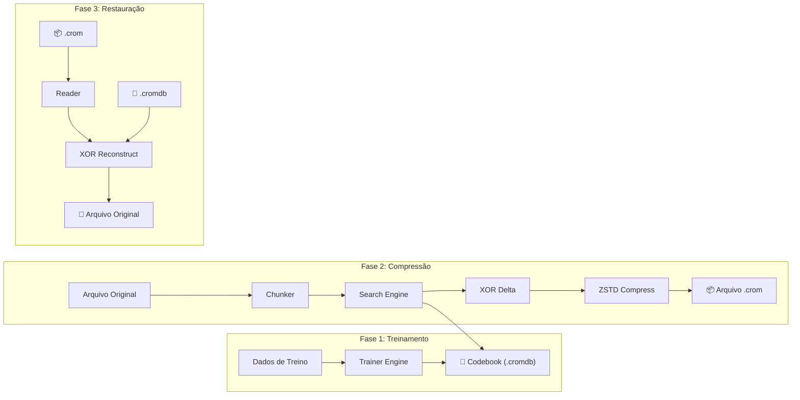
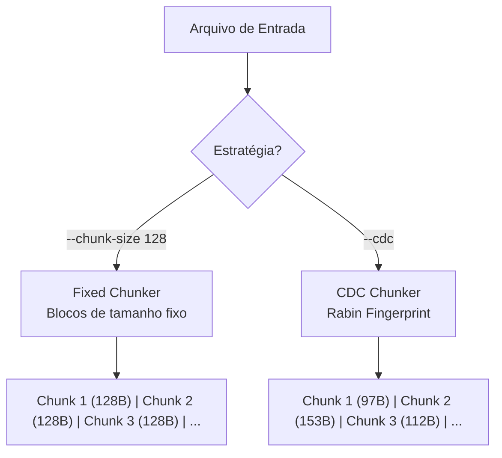
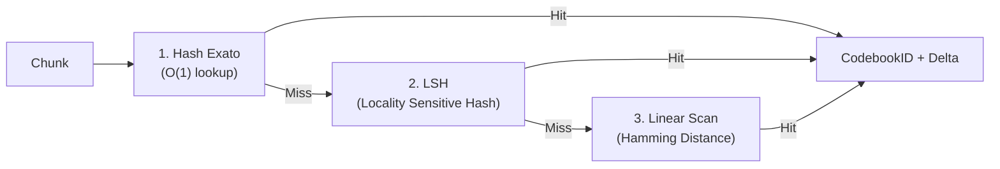
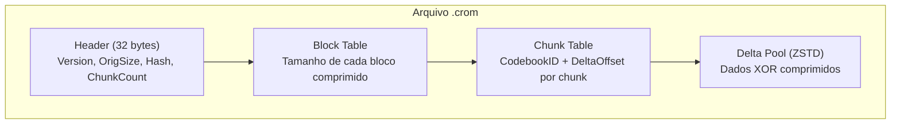
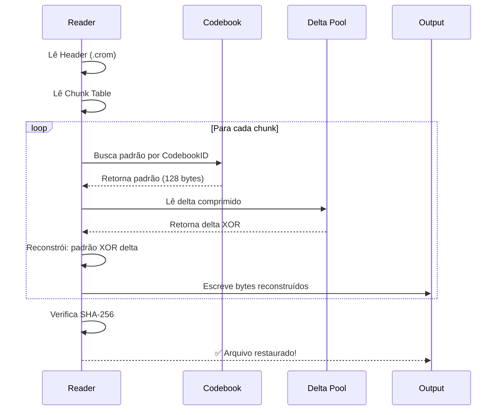

# 🏗️ Arquitetura do Crompressor — Como Funciona

## Visão Geral

O Crompressor é um sistema de compressão baseado em **codebook learning** — ele aprende os padrões dos seus dados e depois usa esse conhecimento para representá-los de forma compacta.



---

## Pipeline Detalhado

### 1. Chunking — Dividir para Conquistar

O arquivo de entrada é dividido em **pedaços (chunks)** de tamanho configurável. Existem 2 estratégias:



| Estratégia | Descrição | Melhor Para |
|:-----------|:----------|:------------|
| **Fixed** | Blocos de tamanho exato (default: 128B) | Dados binários estruturados |
| **CDC** (Content-Defined) | Fronteiras baseadas em hash rolling (Rabin) | Arquivos que sofrem inserções/deleções |

### 2. Search — Encontrar o Padrão Mais Próximo

Para cada chunk, o motor de busca encontra o **padrão mais similar** no codebook usando 3 estratégias em cascata:



| Fase | Complexidade | Descrição |
|:-----|:------------|:----------|
| Hash Exato | O(1) | Match perfeito — delta será zero |
| LSH | O(1) amortizado | Match aproximado via hash de localidade |
| Linear | O(n) | Busca exaustiva por menor distância Hamming |

### 3. Delta — XOR Bit-a-Bit

Após encontrar o padrão mais próximo, calculamos a **diferença (delta)** via operação XOR:

```
Chunk Original: 01101001 10110100 11001010
Padrão Codebook: 01101001 10110000 11001010
─────────────────────────────────────────
Delta (XOR):     00000000 00000100 00000000  ← Quase tudo zero!
```

> Quanto mais similar o chunk é ao padrão, **mais zeros no delta** → melhor compressão ZSTD.

### 4. Formato .crom (V2)



| Seção | Conteúdo | Tamanho |
|:------|:---------|:--------|
| Header | Versão, tamanho original, SHA-256, flags | 32 bytes fixos |
| Block Table | Tamanho comprimido de cada bloco de 16MB | 4 bytes × N blocos |
| Chunk Table | CodebookID (2B) + DeltaOffset (4B) por chunk | 6 bytes × N chunks |
| Delta Pool | Deltas XOR comprimidos com ZSTD | Variável |

---

## Fluxo de Descompressão



---

## CLI — Comandos Disponíveis

```bash
# Treinar codebook
crompressor train -i <pasta_dados> -o codebook.cromdb -s 16384

# Comprimir
crompressor pack -i arquivo.txt -o arquivo.crom -c codebook.cromdb

# Comprimir com CDC e chunk customizado
crompressor pack -i dados.csv -o dados.crom -c codebook.cromdb --cdc --chunk-size 64

# Descomprimir
crompressor unpack -i arquivo.crom -o restaurado.txt -c codebook.cromdb

# Verificar integridade
crompressor verify --original arquivo.txt --restored restaurado.txt

# Analisar arquivo .crom
crompressor info -i arquivo.crom -c codebook.cromdb
```
