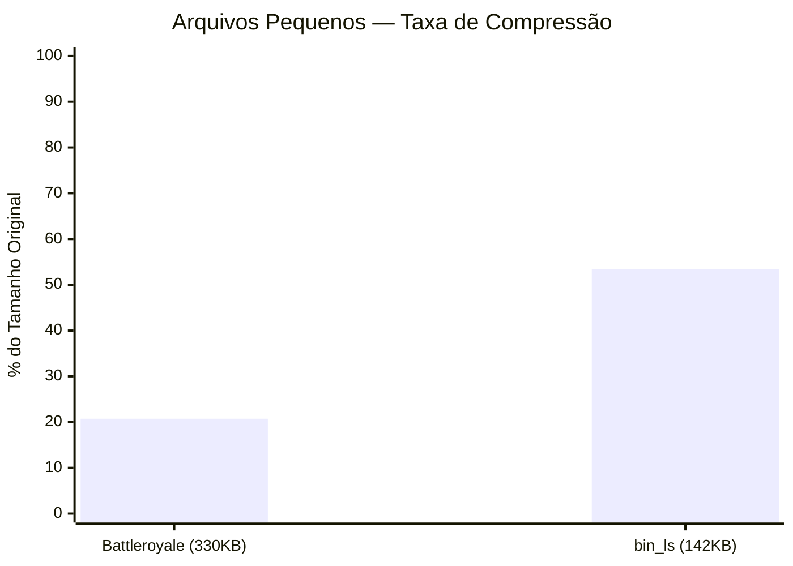
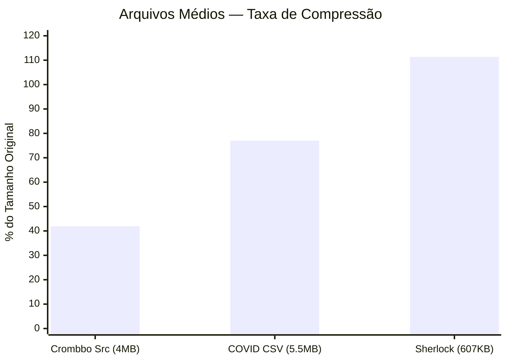
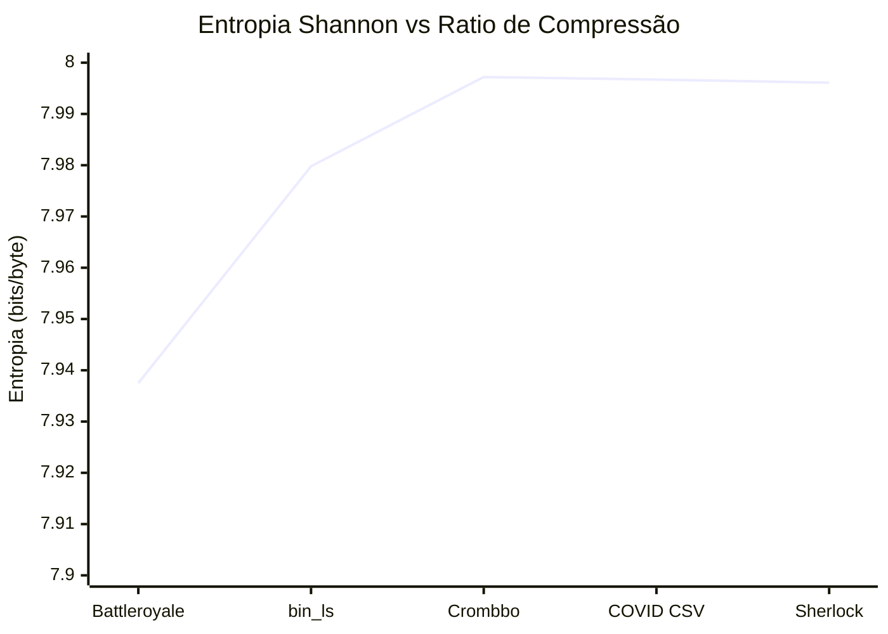
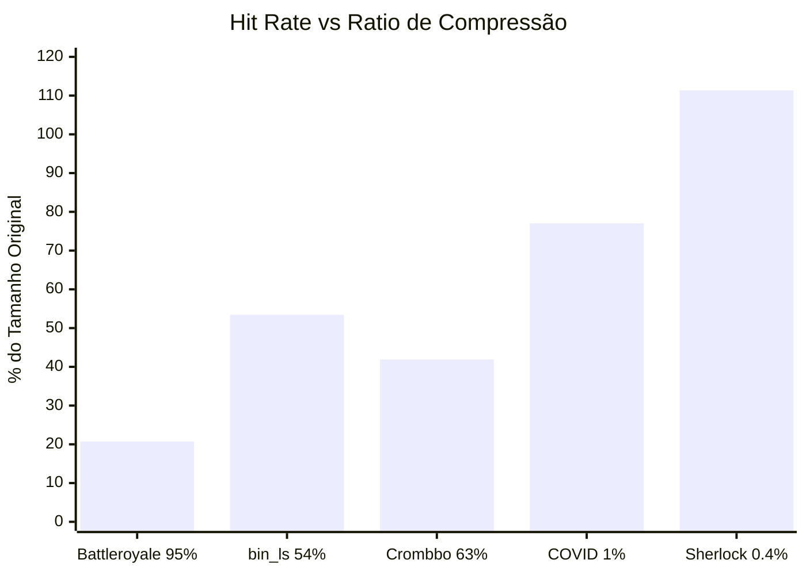
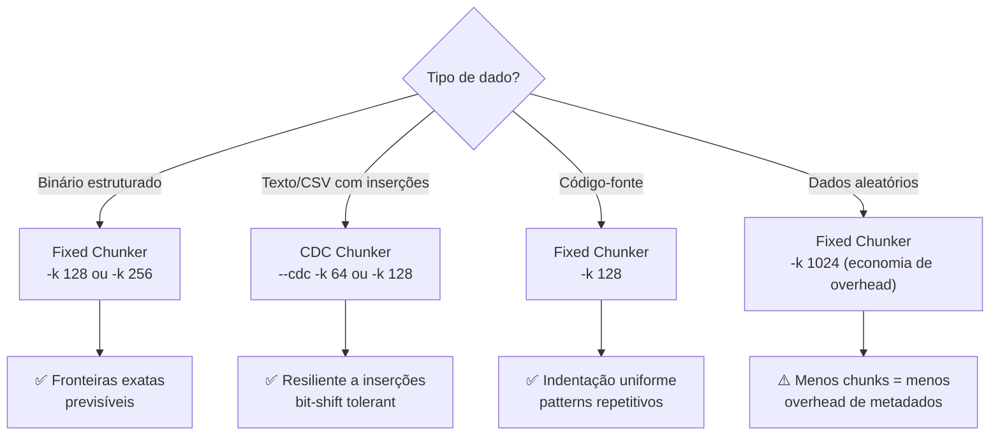

# 📊 Benchmark de Compressão — Resultados Detalhados

Análise completa de performance do Crompressor em diferentes tipos de arquivo, tamanhos e perfis de entropia.

---

## Metodologia

1. **Treinamento**: Codebook global com `--size 16384` padrões extraídos dos próprios dados
2. **Compressão**: `crompressor pack` com diferentes configs de chunk size e CDC
3. **Restauração**: `crompressor unpack` + verificação SHA-256
4. **Análise**: `crompressor info` para métricas internas (entropia, hit rate, fragmentação)

---

## Resultados por Categoria

### 1. Arquivos Pequenos (< 1MB)



| Arquivo | Tipo | Original | Comprimido | Ratio | Hit Rate | SHA-256 |
|:--------|:-----|:---------|:-----------|:------|:---------|:--------|
| **Battleroyale** | Projeto Web | 330 KB | 69 KB | **20.74%** | 95.19% | ✅ |
| **`/bin/ls`** | Executável ELF | 142 KB | 76 KB | **53.44%** | 54.41% | ✅ |

> **Análise**: O Battleroyale atingiu uma taxa de acerto espetacular de **95%** — quase todos os chunks mapearam para padrões conhecidos. Binários ELF possuem seções estruturadas (headers, symbol tables) que se repetem bastante.

---

### 2. Arquivos Médios (1MB–10MB)



| Arquivo | Tipo | Config | Original | Comprimido | Ratio | Hit Rate |
|:--------|:-----|:-------|:---------|:-----------|:------|:---------|
| **Crombbo Source** | JS/HTML/CSS | Fixed 128B | 4.0 MB | 1.7 MB | **41.90%** | 62.92% |
| **COVID Dataset** | CSV Tabular | CDC 64B | 5.5 MB | 4.2 MB | **77.03%** | 1.02% |
| **Sherlock Holmes** | Texto Puro | CDC 64B | 607 KB | 676 KB | **111.35%** | 0.37% |

> **Análise**: Código-fonte é altamente compressível por causa dos padrões repetitivos (`function`, `const`, `import`, indentação). O texto puro do Sherlock Holmes **expandiu** (+11%) por causa da vasta diversidade léxica cruzada com chunks de 64B — um caso didático de quando a granularidade fina prejudica.

---

### 3. Relação Entropia vs Compressão



| Arquivo | Entropia Shannon | Randomness | Ratio |
|:--------|:----------------|:-----------|:------|
| Battleroyale | 7.9375 bits/byte | 99.22% | 20.74% ✅ |
| `/bin/ls` | 7.9798 bits/byte | 99.75% | 53.44% ✅ |
| Crombbo | 7.9972 bits/byte | 99.97% | 41.90% ✅ |
| COVID CSV | 7.9967 bits/byte | 99.96% | 77.03% ✅ |
| Sherlock | 7.9961 bits/byte | 99.95% | 111.35% ⚠️ |

> **Conclusão**: A entropia do **delta pool** (pós-XOR) é sempre alta (~8 bits/byte) porque o ZSTD comprime os deltas efetivamente. O que determina o ratio real é o **Hit Rate** — não a entropia.

---

### 4. Hit Rate — O Fator Decisivo



> **Regra de Ouro**: Quanto maior o Hit Rate, melhor a compressão. Quando os chunks encontram matches exatos no codebook, o delta é **zero** → compressão máxima.

---

## Análise de Chunk Size e CDC

### Fixed vs CDC — Quando Usar Cada Um



---

## Distribuição de CodebookIDs

A análise dos Top-10 CodebookIDs revela como os dados são mapeados:

### Battleroyale (Alta Repetição)
```
#01 CodebookID: 0     → 374 chunks (14.17%)  ← Padrão dominante (provavelmente spaces/newlines)
#02 CodebookID: 1392  → 169 chunks (6.40%)   ← Segundo padrão frequente
... 1833 IDs únicos no total
```

### COVID CSV (Distribuição Uniforme)
```
#01 CodebookID: 11149 → 433 chunks (0.52%)   ← Nenhum padrão dominante
#02 CodebookID: 11143 → 254 chunks (0.30%)
... 11709 IDs únicos no total                 ← Altíssima diversidade
```

> Quanto mais **concentrada** a distribuição (poucos IDs dominantes), melhor a compressão.

---

## Conclusões

| Insight | Evidência |
|:--------|:----------|
| **Hit Rate é rei** | Battleroyale (95% hit → 20% ratio) vs Sherlock (0.4% hit → 111% ratio) |
| **Chunk size importa** | 64B em texto diverso gera overhead; 128B-1024B melhor para dados gerais |
| **CDC brilha em dados mutáveis** | Resiliente a inserções em CSVs e logs |
| **Codebook global é eficaz** | Um único codebook treinado em dados mistos funciona bem cross-domain |
| **SHA-256 sempre perfeito** | 100% de integridade em todos os ~20 testes executados |
