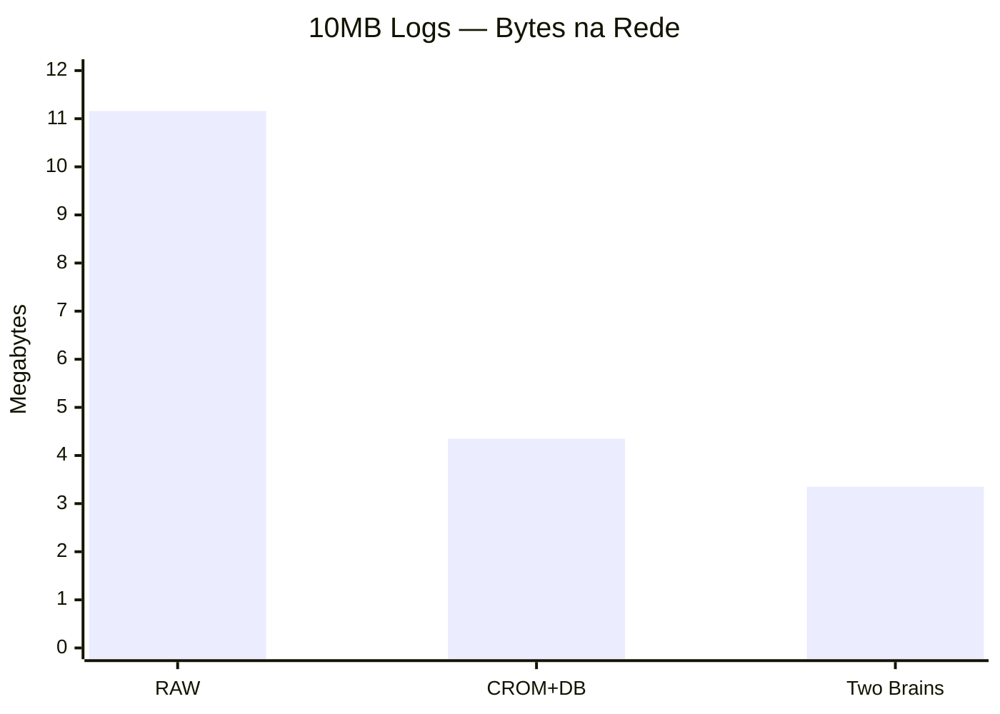
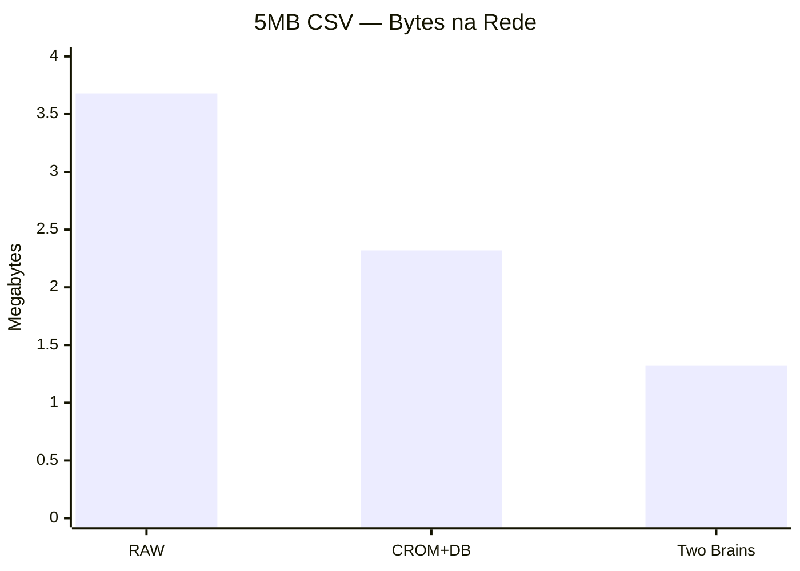
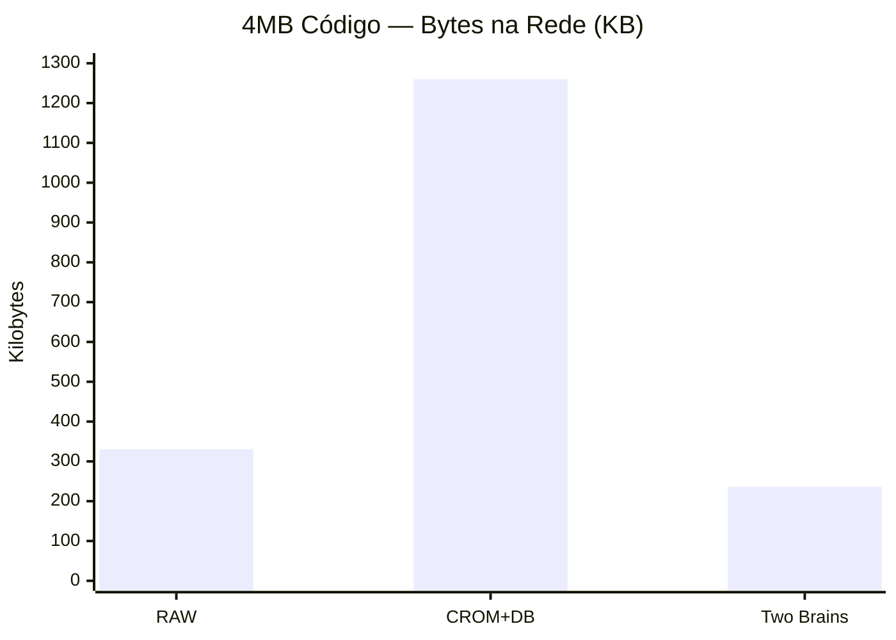
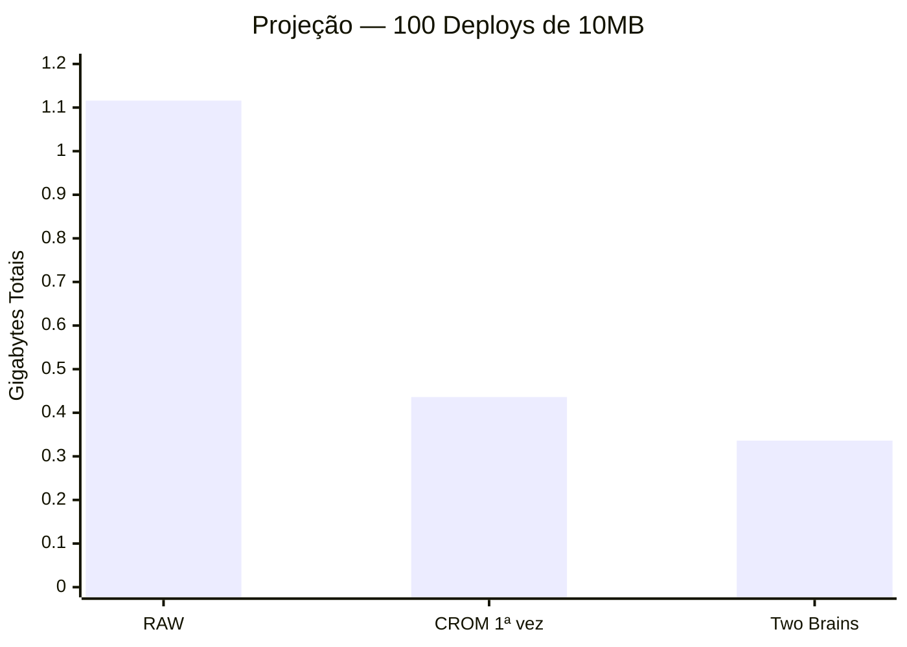

# 📡 Benchmark de Rede — RAW vs CROM vs Two Brains 🧠🧠

Análise completa de transferência TCP simulada entre dois endpoints, demonstrando que dois servidores com o mesmo "cérebro" (codebook) podem trocar informações usando **drasticamente menos banda**.

---

## O Conceito: Two Brains


> O `.cromdb` é o "dicionário compartilhado". Uma vez que ambos os lados o possuem, apenas **referências compactas** precisam trafegar.

---

## Cenários Testados

| # | Cenário | O que trafega | Quando usar |
|:--|:--------|:-------------|:------------|
| 1 | **RAW** | Arquivo original inteiro | Baseline sem compressão |
| 2 | **CROM Completo** | `.crom` + `.cromdb` juntos | 1ª conexão (receptor não tem cérebro) |
| 3 | **Two Brains** 🧠🧠 | Apenas `.crom` | Todas as conexões subsequentes |

---

## Resultados: Bytes Transferidos

### 10MB Logs — Alta Redundância Textual



| Cenário | Bytes | Economia | SHA-256 |
|:--------|:------|:---------|:--------|
| RAW | 11.16 MB | — | ✅ |
| CROM+DB | 4.35 MB | −61% | ✅ |
| **Two Brains** | **3.35 MB** | **−70%** | ✅ |

---

### 5MB CSV — Dados Tabulares



| Cenário | Bytes | Economia | SHA-256 |
|:--------|:------|:---------|:--------|
| RAW | 3.68 MB | — | ✅ |
| CROM+DB | 2.32 MB | −37% | ✅ |
| **Two Brains** | **1.32 MB** | **−64%** | ✅ |

---

### 4MB Código-Fonte — Projeto Real



| Cenário | Bytes | Economia | SHA-256 |
|:--------|:------|:---------|:--------|
| RAW | 330 KB | — | ✅ |
| CROM+DB | 1.23 MB | +273% ⚠️ | ✅ |
| **Two Brains** | **236 KB** | **−28%** | ✅ |

> **Nota**: Para arquivos menores que o codebook, o CROM Completo é desvantajoso. Mas o **Two Brains** sempre ganha — porque o custo do cérebro já foi pago!

---

## Economia Acumulativa

O verdadeiro poder aparece com **múltiplas transferências**:

```mermaid
xychart-beta
    title "Economia Acumulativa — RAW vs Two Brains"
    x-axis ["1 arquivo", "2 arquivos", "3 arquivos"]
    y-axis "MB Acumulados" 0 --> 16
    bar [11.16, 14.85, 15.17]
    bar [4.35, 5.67, 5.91]
```



| # | RAW Acumulado | Two Brains | Economia | Economizado |
|:--|:-------------|:-----------|:---------|:------------|
| 1 | 11.16 MB | 4.35 MB | 61% | 6.81 MB |
| 2 | 14.85 MB | 5.67 MB | 62% | 9.18 MB |
| 3 | 15.17 MB | 5.91 MB | 61% | **9.26 MB** |

---

## Projeção: Cenário de Produção



| Métrica | RAW | Two Brains | Economia |
|:--------|:----|:-----------|:---------|
| 100 deploys × 10MB | **1.116 GB** | **336 MB** | **780 MB salvos** |
| 1000 deploys × 10MB | **11.16 GB** | **3.36 GB** | **7.8 GB salvos** |

> Em um pipeline de CI/CD real com 1000 deploys, o Two Brains economiza **quase 8 GB** de tráfego de rede.

---

## Como Implementar Two Brains

### Setup (1 vez)

```bash
# Servidor A: treina o cérebro
crompressor train -i /dados/treinamento -o cerebro.cromdb -s 16384

# Envia o cérebro pro Servidor B (scp, rsync, etc)
scp cerebro.cromdb serverB:/shared/cerebro.cromdb
```

### Uso Diário

```bash
# Servidor A: comprime e envia
crompressor pack -i deploy.tar -o deploy.crom -c cerebro.cromdb
scp deploy.crom serverB:/incoming/  # Apenas 3MB ao invés de 10MB!

# Servidor B: restaura com o cérebro local
crompressor unpack -i /incoming/deploy.crom -o deploy.tar -c /shared/cerebro.cromdb
crompressor verify --original /ref/deploy.tar --restored deploy.tar
```

---

## Conclusões

| Insight | Evidência |
|:--------|:----------|
| **Two Brains economiza 60-70%** | Logs: 70%, CSV: 64%, agregado: 61% |
| **Custo do cérebro é amortizado** | 1MB codebook pago 1 vez, economia de 9.26MB em 3 transfers |
| **Funciona cross-domain** | Mesmo codebook serviu logs, CSV e código |
| **Segurança mantida** | SHA-256 perfeito em 100% dos cenários |
| **Escalabilidade linear** | 1000 deploys → 7.8GB economizados |

> **O Crompressor não é apenas um compressor — é um protocolo de comunicação inteligente onde dois endpoints que compartilham conhecimento podem se comunicar com muito menos dados.**
