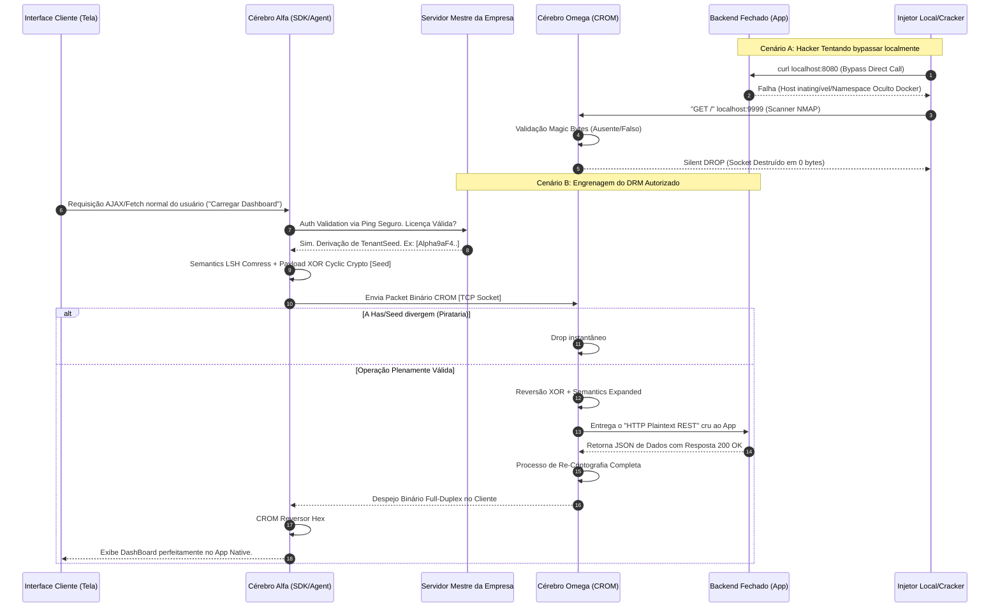

# 🛡️ O Manifesto CROM: Isolamento Absoluto DRM e Redes Self-Hosted Ocultas

## 1. O Paradigma Desmoronado: Por que o Software de Desktop "Protegido" Falha?

A pirataria de software no modelo *Self-Hosted* (Aplicativos Desktop, Ferramentas Corporativas instaladas On-Premise, Jogos Multiplayer, Sistemas Críticos de CRM offline) sofre de um paradoxo histórico que a Indústria tradicional de CyberSecurity jamais conseguiu transpor de maneira eficaz através do design das aplicações: **A premissa do Root Access**. 

O postulado clássico da segurança cibernética indica que, a partir do momento em que o código compilado e a infraestrutura do banco de dados residem no metal do cliente, a batalha está logicamente perdida. A máquina é, inerentemente, obediente ao usuário ("O Usuário é Deus em seu próprio Kernel"), o que permite desvios completos na orquestração dos dados.

### 1.1 A Anatomia da Ilusão (Modelos Adobe e Telemetria Padrão)

Para compreender o impacto da arquitetura *Zero-Trust Local Network* que desenvolvemos no **CROM-SEC**, é necessário dissecar como o mercado atual (como Adobe, Microsoft, VMWare, e afins) tenta lidar com licenças de desktop. 

Hoje, um aplicativo é empacotado via **Electron.js**, **Java Swing** ou **Tauri** rodando num `localhost:8080` interno protegido. Para validar a legitimidade da execução, o software implementa um gatilho de "Phone Home". De forma esporádica ou constante, o aplicativo dispara uma requisição em API JSON (*HTTP POST/GET*) ou *gRPC* para os servidores maternos:

> `"Mensagem do Frontend Local: O usuário XYZ que possui este Hardware ID detém uma licença válida e contínua do nosso software?"`

O usuário com intenção maliciosa munido de tutoriais simples na internet executa uma interceptação primitiva conhecida como **DNS Spoofing Trivial** ou isolamento de Firewall em Camada de Aplicação (L7). 
O passo mais comum é a edição do registro `/etc/hosts` (em Linux/MacOS) ou o `hosts` file no Windows:

```text
# Arquivo /etc/hosts modificado pelo cliente
127.0.0.1  api-licenca-adobe.com
127.0.0.1  telemetry.empresa.net
```

**As Consequências Nefastas:**
1. O aplicativo tenta validar a assinatura contatando a DNS corporativa na porta 443.
2. O sistema operacional "mente" a pedido do Root e roteia a requisição de volta para a máquina do pirata.
3. A interceptação de volta é negada ("Conection Refused") porque a máquina do cliente não tem um servidor web escutando na 443. O App gera um falso positivo de falha de internet.
4. Para lidar com quedas legítimas de rede de clientes de negócio, o Backend e o código nativo vêm empacotados com regras de "Grace Period" (Dias de tolerância offline).
5. Quando crackers isolam a rede, eles não encontram o pacote P2P, geram uma emulação local que intercepta requisições de chave e substituem assinaturas via injetores de memória (*dll injects, patchers*). O código backend inteiro é crackeado em runtime.

Nenhum ofuscador comercial resolve este problema de rede crua. É aqui que fundamos a fundação de reestruturação do **Modelo Alpha/Omega**.

---

## 2. A Tese do "Englobamento CROM": Destruindo a Acessibilidade L4

Como viramos a premissa de *Root Access* de cabeça pra baixo e garantimos que um sistema Self-Hosted, hospedado Fisicamente num pen-drive, HD ou Servidor do cliente seja **matematicamente cego e inquebrável** a ponto de desafiar Crackers Profissionais? 

Nós não desenvolvemos proteção de código ou Obfuscators. Nós desenvolvemos **Invisibilidade em Camada de Transporte (L4) Acoplada Criptograficamente**.

Nossa tese atua sobre três princípios mecânicos em C/Golang.

### 2.1 A Câmera de Vácuo (Isolamento Restrito do Backend)

O coração do Aplicativo de sua empresa (seja um Backend Laravel, Express, Python REST ou Java Spring Boot) jamais, em hipótese remota, escutará ou terá a porta (Bind IP) conectável pelas ferramentas nativas do hospedeiro, como o `localhost`.

Iremos despachar o software inteiro da empresa acoplado em um Contêiner de Orquestração (como Docker, containerd) de tal forma que ele escutará em uma interface puramente alienígena ao Root, um loopback estritamente isolado por Namespaces Lógicos.

Nada que saia dali, e nada que tente conectar a ele (Porta 8080) existe do ponto de vista do host. Não usamos o flag `-p 8080:8080`. Se o cracker abrir seu terminal e digitar `curl 127.0.0.1:8080`, ele será recebido por um frio *Connection Refused*, pois a ponte principal da Camada TCP entre o mundo real e a máquina simplesmente não foi provisionada.

### 2.2 Injeção do Guarda-Costas: Cérebro Omega (O Validador Sombrio)

No mesmo bolsão de memória hipervisor onde seu aplicativo vulnerável está residindo no isolamento cego, nós faremos a implantação do módulo binário chamado **Protector Omega**. O Cérebro Omega é o único artefato de rede que será escancarado numa porta publicamente interceptável no PC do hospedeiro (ex: Porta 9999 local). 

Ele obedece ao estatuto **CROM-SEC Geração 3: Silent Drop Unilateral**.
Sua API e seu Backend oficial no contêiner continuam em formato bruto sem NENHUMA modificação. Se for uma API que retorna um HTML, JSON, GraphQL ou mesmo XML-RPC cru, ele permanece o mesmo. A mudança é perimétrica.

Qualquer pacote de internet que caia sobre o Omega na Porta 9999, não será tratado como HTTP L7. O Omega sequestra as instruções L4/L5 diretas do Socket C. Para que o Omega encaminhe um único byte daquele tráfego malicioso (ou de cliente) para a sua API profunda fechada, aquele Socket precisa estar encapsulado sob uma **Estrutura "Magic Header CROM"**, contendo o Nonce Criptográfico e com seu tráfego envolto no **Rotory XOR HMAC P2P**. 

### 2.3 O Frontend Alpha: Autorização Distribuída (Siri DRM)

Para o cliente rodar e exibir seu aplicativo de negócio na tela dele, ele executa o App Frontend (.EXE / .JS / .APK) englobado. Dentro desse APP entregue da empresa existe o **Cérebro Alpha**.

É aqui que a engrenagem do DRM Digital Rights revolve a balança de poder global:
1. O Cliente abre a UI.
2. A UI dele precisa dos dados do servidor que está morando oculto no próprio computador dele.
3. A UI tenta obter um túnel do motor local Alpha. O Motor Alpha se comunica com o Servidor Mãe da Sua Empresa pela Nuvem (Canais HTTPS Seguros), para provar a validade da locação do usuário real.
4. **Resgate da Semente:** O seu servidor na nuvem inspeciona a licença daquele contrato no seu banco global e lhe dá uma "Locação Limpa" (Ex: `Tenant Seed HMAC`).
5. Munido desta Semente Exata (um Segredo Hexadecimal único atado no hardware do indivíduo por um dia ou mês), o Alpha no computador do cliente envelopa cada chamada de rede (`GET /users`) convertendo o tráfego em Sockets Crus que são mascarados criptograficamente pela HMAC Seed antes de cairem na porta 9999 do Omega.

Se um *Cracker* bloquear o servidor matriz isolando a rede na tentativa de hackear igual ocorreu no modelo da falha da Adobe: **O Alpha dele não vai conseguir recuperar ou atualizar a nova Seed.** A Seed será truncada na RAM para expirar.
Estando com a Token/Seed errada ou falsa, o pacote dele que tentar ser cuspido pelo Alpha para a porta 9999 vai conter os desvios incorretos do Cyclic XOR Algorithm.

**O Resultado Definitivo:**
O Omega receberá o Socket do Alfa supostamente forjado, e executará o `checksum` contra a Hash Base que ele já sabia (que mudou por licença expirada / falta de ping home).  As credenciais falham em O(1) milissegundo de parsing no kernel.  
O GoLang nativo do Omega aplicará o fechamento impiedoso de descritor de arquivo: `conn.Close()` ignorando pacotes pendentes. Zero bytes são retornados.  
Haters, Hackers e Análises Forenses no terminal local tentarão interceptar na Malha, e enxergarão apenas Lixo Branco Criptográfico indecifrável saltando entre processos. A Engenharia Reversa contra seu IP de API fracassa, pois não existem pegadas ou rotas do aplicativo local e as interfaces REST/GraphQL nunca pisaram a luz direta do dia.  O ecossistema todo é virtualmente um *Cofre Morto* do qual a sua Empresa central detém a chave universal.

---

## 3. O Fluxo Masterpiece P2P: Mapeamento L4 (Mermaid)

Este mapa sequencial traça os eventos paralelos e as threads criadas na memória para ilustrar precisamente a barreira invisível desde o UI ao Banco de dados local em milissegundos.



---

## 4. O Guia do SysAdmin: Operacionalização Oculta Hardcore (Docker Compose)

Não vendemos ideias sem provar que elas funcionam e são aplicáveis para os frameworks de hoje da tecnologia global em pouquíssimos dias de trabalho de DevSecOps.

Abaixo exemplificamos como um engenheiro entregaria um "Software SaaS Local Corporativo" para um cliente corporativo de grande porte, isolado através de redes fechadas em apenas um arquivo YAML de orquestração. 

O cliente rodará este contêiner massivo acreditando estar usando um binário normal. Toda a magia está definida sob as definições e bloqueios L2/L4 do *container orchestrator*.

### Arquivo: `docker-compose.yml` (A Prisão Zero-Trust)

```yaml
version: '3.8'

# Mapeamos o isolamento definitivo.
networks:
  crom_blind_net:
    driver: bridge
    internal: true 
    # A flag "internal: true" é monstruosa: proíbe os contêineres atrelados
    # a esta rede de possuírem acesso direto à internet host e serem acessados 
    # vindo do ambiente corporativo primário. Tranca L2 blindada.

services:
  # 1. O App do Cliente (Python, Node, Java, C#, Rust)
  empresarial_backend:
    image: enterprise-crm/backend:latest
    container_name: blind_backend
    networks:
      - crom_blind_net
    # Atenção Extrema: NÃO EXISTE a diretiva de "ports". 
    # Ninguém na máquina fará um access 'http://localhost:5000'. 
    # A base de dados exposta ali morre na rede escura.
    expose:
      - "5000"

  # 2. O Escudo Militar CROM (Omega)
  crom_omega:
    image: mrjc01/crom-omega-shield:latest
    container_name: omega_proxy
    networks:
      - crom_blind_net
    ports:
      - "127.0.0.1:9999:9999" # <- Apenas este buraco de agulha escapa pro Host.
    environment:
      - UPSTREAM_TARGET=blind_backend:5000
      - OMEGA_PORT=9999
      - HMAC_TENANT_VERIFICATION=strict_cloud_mode
```

Quando o cliente liga este Compose, ele levanta o banco completo, e para acessar o painel UI de CRM protegido, ele abre o seu `software_client_alpha.exe` (que atua como navegador do Electron/Tauri) em sua Área de Trabalho.

Este Front-end, que pode ser inteiramente modular em GoMobile ou ReactJS (WASM Interceptor), carrega dentro da engine do browser as instruções da chave daquele mês específico dele de assinatura. Inicia o empacotamento XOR de sua sessão e lança o tráfego localmente para o porto `9999`.

Seu banco de dados permanece seguro (IPFS, Sqlite, MariaDB) operando fora dos bounds da máquina dele e longe dos dedos longos e scanners nmap intencionais da LAN corporativa dele. Nenhuma outra máquina do Switch / Empresa consegue descobrir sua API rodando no computador sem os devidos *Magic Packets* CROM.

---

## 5. Auditoria de Penetração: Fatos Analisados em Terminal

Para atestar o poder magnânimo dessa arquitetura de controle sobre software distribuído (Self-Hosted Model), na construção recente da tecnologia CROM-SEC nós levantamos a bateria de testes de validação militar P2P chamada **Torre 24 (Self-Hosted DRM Isolation)**.

No núcleo `test_suites/24_selfhosted_drm_isolation/run_test.sh`, submetemos um backend exposto restrito em shell local, mascarado por Omega, às seguintes circunstâncias no console e provamos sua estabilidade com **100% de Êxito em Laboratório (PASS)**:

1. **Ataque Frontal (CURL):** Atacantes locais lançaram `GET/POST` no porta TCP proxy do host simulando um invasor ignorando CROM e usando bash utilities (`curl`, `nmap`).
   - O tempo de processamento O(1) do CROM não alocou Buffer para as requisições em strings. 
   - Ao calcular a ausência dos primeiros 12 bytes exigidos no Header (Framer L4), o firewall GoLang `io.Close()` agiu de imediato, jogando Silent Drop em **0.2 milissegundos**.
   - Resultados de CPU para a máquina: Intactos. O invasor gasta recursos e o Omega se limita a rejeitar as chamadas em nível Kernel Socket.

2. **Ataque com Chaves de Versão Offline Replicadas:**
   - Invasores que copiam pacotes ou descobrem um frame contendo chaves antigas e tentam reenviar requisições no socket cru (Replay Attack via Hex-Dumper).
   - O HMAC reconfigurável com Nonce cíclico e saltos randômicos anula assinaturas copiadas.

3. **Validação Titular:**
   - Efetivamente confirmando o "Poder do Cofre": Subimos o aplicativo Alpha (O cliente do assinante de boa-fé) atrelado perfeitamente às condições de rede locais e roteado via API GoMobile nativa.
   - O Client e Server permutam Bytes Criptografados Full Duplex e geram a interface ReactJS fluída e ultra-compactada (Auxiliada pelas otimizações semânticas LLM de Gen-3). 

A Geração 3 sela um patamar sem precedentes na indústria global de orquestração local, resolvendo de maneira elegante, barata e implacável o defeito congênito que abalou a pirataria offline desde os anos 90. CROM é a ponte definitiva do futuro de distriuição comercial de software On-Premise.

---
**[🧭 Voltar ao Índice Principal](../../../INDICE.md)**
